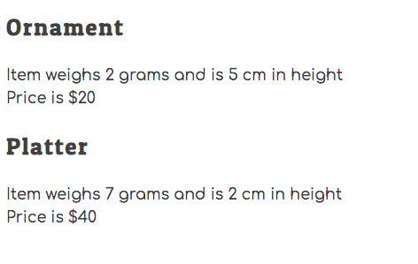

# The Hairy Potter

In this project, your task to build a workflow for making, and firing pottery, and then determining if it should be sold at a craft show. Then you will display the pottery to be sold in the DOM.

> 🧨 Make sure you answer the vocabulary and understanding questions at the end of this document before notifying your coaches that you are done with the project

## Setup

```sh
cd hairy-potter
cd src
code .
```

1. Run the `serve` command to start the web server.
1. Open the URL provided by `serve` in your browser.

## Requirements

### Making Pottery at the Wheel

1. Create a `scripts/PotteryWheel.js` module.
1. Define a variable in the module to have the value of the primary key for each piece of pottery. It should have an initial value of 1.
1. Define and export a function named `makePottery`.
1. The `makePottery` function must accept the following values as input _(i.e. it needs parameters)_, in the following order.
   1. Shape of the piece of pottery (e.g. "Mug", "Platter")
   1. Weight of the piece (e.g. 1, 5)
   1. Height of the piece (e.g. 3, 7)
1. The `makePottery` function must return an object with the following properties on it.
   1. `shape`
   1. `weight`
   1. `height`
   1. `id` _(increment this value each time the function is invoked)_

#### Checking Your Work

In the `main.js` module, invoke the `makePottery` function and provide the required values as arguments. Store the object that gets returned into a variable, and then use `console.log()` to view the object.

Once you have it working, make 5 pieces of pottery in `main.js`.

**THEN PUSH YOUR CODE TO GITHUB**

### Firing the Pottery in the Kiln

1. Define a `scripts/Kiln.js` module.
1. Define and export a function named `firePottery` that is responsible for acting as a kiln.
1. The function must accept the following values as input _(i.e. it needs parameters)_, in the following order. If you don't remember, you can easily [add new properties to objects in JavaScript](https://www.dyn-web.com/tutorials/object-literal/properties.php).
   1. An object representing a piece of pottery that was made at the wheel in the `makePottery` function.
   1. A number specifying the firing temperature of the kiln.
1. The function must add a new property of `fired` with the value of `true` to the object.
1. The function must add a new property of `cracked` to the object.
   1. If the temperature of the kiln is above 2200 degrees then `cracked` property must have a value of `true`.
   1. If the temperature of the kiln is at, or below, 2200 degrees then `cracked` property must have a value of `false`.
1. After both of the new properties have been added, return the augmented object.

#### Checking Your Work

In the `main.js` module, invoke the `firePottery` function for each of the 5 pieces of pottery you created. Ensure you provide the required values as arguments. Store the object that gets returned into a variable, and then use `console.log()` to view the objects and make sure it has the right properties on each.

To check your work, make sure that at least one of your pieces of pottery is fired at a temperature that is too high.

**THEN PUSH YOUR CODE TO GITHUB**

### Pricing Uncracked Pottery

1. Create a `scripts/PotteryCatalog.js` module.
1. Define a variable in the module with a value of an empty array. This array will store pottery that will be sold. Do not export this array.
1. Define and export a function named `toSellOrNotToSell` that is responsible for determining if a piece of pottery should be sold.
1. The `toSellOrNotToSell` function must accept a pottery object as input.
1. If the weight of the piece of pottery is greater than, or equal to, 6 then the function must add a `price` property with a value of 40.
1. If the weight of the piece of pottery is less than 6 then the function must add a `price` property with a value of 20.
1. If the piece of pottery is cracked, do not add a `price` property to it.
1. If the pottery is **not** cracked, add the object to the module-level array of items to be sold.
1. Return the augmented object.
1. Define and export a function named `usePottery` returns a copy of the array of items to be sold. Recall which global javascript function creates a deep copy of values.

#### Checking Your Work

In the `main.js` module, invoke the `toSellOrNotToSell` function for each of the 5 pieces of pottery you created. Ensure you provide the required value as an argument.

**THEN PUSH YOUR CODE TO GITHUB**

### Display the Catalog

Your next task is to create HTML representations of the pottery you want to sell at the craft fair and display them on the DOM. Then you will track which ones you sell.

#### Define DOM Target

1. Create an `<article>` element in the `index.html` file.
1. The article element must have a class of `potteryList`.

#### Create Pottery HTML

1. Create a `scripts/PotteryList.js` module.
1. Define and export a `PotteryList` function.
1. The `PotteryList` function must get the items to be sold from the `PotteryCatalog.js` module.
1. The `PotteryList` function must convert each object in the array to an HTML representation string. Use the following template to generate the representations.
   ```html
   <section class="pottery" id="pottery--1">
     <h2 class="pottery__shape">Mug</h2>
     <div class="pottery__properties">
       Item weighs 3 grams and is 6 cm in height
     </div>
     <div class="pottery__price">Price is $20</div>
   </section>
   ```
1. The `PotteryList` function must then return a single string that contains ALL of the pottery HTML representation.

#### Checking Your Work

In the `main.js` module, invoke the `PotteryList` component function. Take its return value and update the inner HTML of the article element you created above. When you start your web server, you should see your non-cracked pottery list appear (_example below_).



**THEN PUSH YOUR CODE TO GITHUB**


## Vocabulary and Understanding

> 🧨 Before you click the "Assessment Complete" button on the Learning Platform, add your answers below for each question and make a commit. It is your option to request a face-to-face meeting with a coach for a vocabulary review.

1. Explain how you got the HTML, with the correct data, displayed in the browser?
   > Your answer here: In order to get the correct data displayed in the browser, I first created a function that acts as a potteryWheel, wherein the parameters getting passed into the function defined the shape, weight and height of 5 pieces of pottery. Following the declaring of this function, I exported that into a main module where the function gets invoked with specific properties of types of pottery. Next, I built a function that operates as a kiln for firing the pottery. This function is declared with an object that defines if a piece of pottery is first fired (yes to all of them), and then whether or not that same piece of pottery is cracked or un-cracked depending on the temperature at which it was fired. Function was imported into the main module where it gets invoked with certain arguments per pottery piece that get passed through the parameters of the function. Next, I made a function that is declared with an object wherein if the pottery piece is NOT CRACKED, then it must meet certain conditions to get priced at either $40 or $20, which is dependent on its weight. That function gets imported into the main module and is invoked there with certain pottery items getting passed into the "pottery" parameter in the function. I then cloned that data that was output by the invoked function into an empty array set to a variable, then wrote and declared a function set to aforementioned array variable, then imported that function containing the array into a PotteryList file. Here is where I created a function that, when called, iterates through the imported array, and applies certain properties from the array into a 'string' of HTML text. Export that function into main module. And here in main module is where I rendered that imported function (containing HTML) into actual HTML to be referenced in my index file, which then is displayed onto the web browser.

2. In the **PotteryList** module, when you iterate your pottery, you need to show the evidence of what the **weight** property's value is for the 2nd piece of pottery. Use [Loom](https://www.loom.com/) to record your browser window with the developer tools open and show those values.
   > Paste your video's public URL here: https://www.loom.com/share/88f5f5cd363a4cd385d2338d521afe49?sid=5d4a8ccd-33d2-4a49-8103-19bbe17fefbd

3. The **PotteryWheel** module has a single function named `makePottery`. Why doesn't that module have all of the other code in it?
   > Your answer here: This module contains only the one function because that is all that is needed to be declared. It is not referencing any other functions or arrays from other modules, hence why there are no imports or references to other code in this module. The module is itself just a function declaration that gets exported for later use when invoked. Additionally, it can be viewed as the beginning of the sequence of events. therefore not requiring any code that is created later on in the sequence.  

4. The pottery shop has learned that there is a set of customers that are willing to buy cracked pottery at a discounted price of $2.50. That means that the cracked pottery should now be displayed in the catalog. Explain the changes that this new business strategy would cause to your algorithm.
   > Your answer here: In order to keep the NOT cracked pottery displayed, then additionally display cracked pottery at the price of $2.50, I would first create a new function in PotteryCatalog. This function would similarly iterate through the same array as the function that looks for NOT cracked pottery. However, this function would look for pottery.cracked, and if it is present then it would return the value of pottery.price=$2.50, since there is only one price its set at. I could then export that and follow the same steps to invoke it and write it into some HTML string that gets rendered for the web browser. The biggest thing here is that pottery.cracked is what gets iterated on in the array of information, instead of the !pottery.cracked as I have listed currently.  

5. In the **Kiln** module, you have a `firePottery()` function. You need to demonstrate how to use the debugger to verify the values of the parameters for that function when your code runs. Use [Loom](https://www.loom.com/) to record your browser window with the developer tools open and show those values.
   > Paste your video's public URL here: https://www.loom.com/share/9fb22df9ed8343fc9dce6ad52cbf553a?sid=2114ae80-2915-4afc-8e6a-be681b513b48
